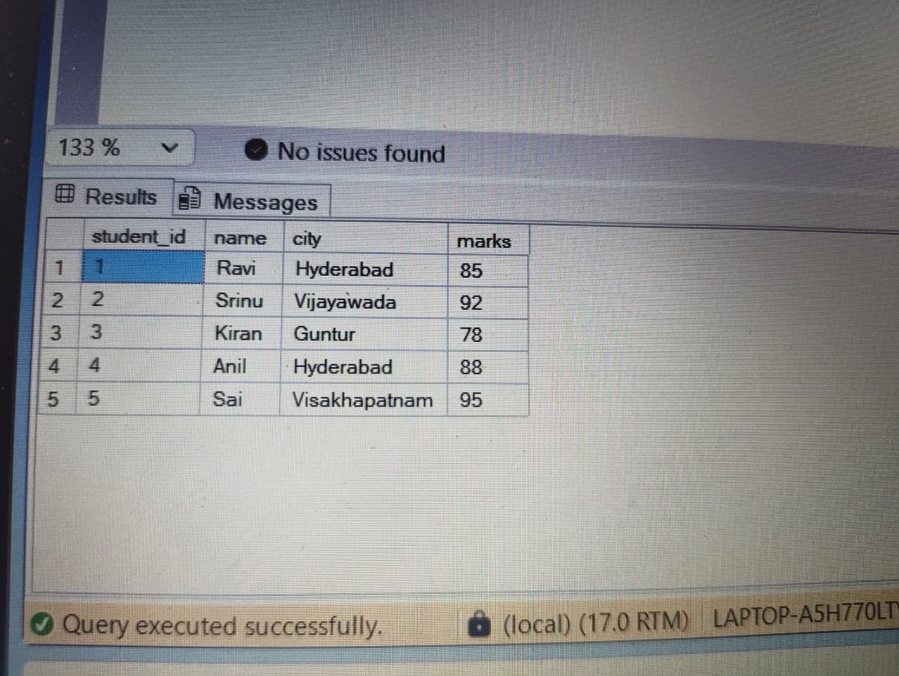

# SQL Student Management System

## Project Overview
This project demonstrates SQL concepts using a Student Management System database.

## Tables
1. Students
2. Courses
3. Enrollments

## SQL Concepts Used
- CREATE TABLE
- INSERT INTO
- SELECT
- WHERE
- ORDER BY
- GROUP BY
- HAVING
- INNER JOIN
- Aggregate Functions

## Sample Queries

### Students from Hyderabad
SELECT * FROM Students
WHERE city = 'Hyderabad';

### Highest Marks
SELECT MAX(marks)
FROM Students;

### Student and Course Details
SELECT Students.name, Courses.course_name
FROM Students
INNER JOIN Enrollments
ON Students.student_id = Enrollments.student_id
INNER JOIN Courses
ON Enrollments.course_id = Courses.course_id;
## Output Screenshots

### Students Table Output

### Join Query Output

